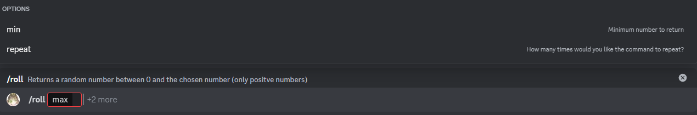
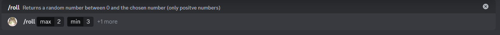

# Roll

This is the roll command, with it, you can generate a "random" number between a minimum value and a maximum value
with the option to repeat the number generation up.

## Usage

`/roll <max> {min} {repeat}`

## Explanation

This command has 1 required parameter and 2 optional parameters, the first parameter will always be the maximum number the bot can reply with (1 is the minimum for this), the second parameter is the minimum number the bot can reply with, it must be lower than the maximum number, the third and last parameter define how many times (up to 100) you want the bot to repeat the roll command.

### Required parameters

* max: This parameter determines the maximum number, it must be 1 or greater than 1 and can't be a negative number.

### Optional parameters

* min: This parameter determines the minimum number, it must lower than the maximum number, or a error will be returned.
* repeat: This parameter determines the ammount of times the bot will repeat the command, by default it will be 1, this mean that if you want just one roll, you don't need to send this parameter.

## Potential errors

### Minimum number is greater than maximum

This error will happen if the minimum number is greater than the maximum number, due to how the command works this is invalid. 

To solve it, you must specify a greater maximum number than the minimum number.