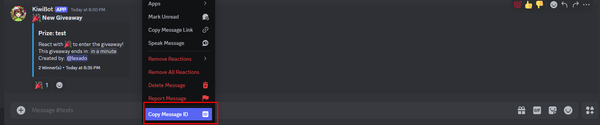
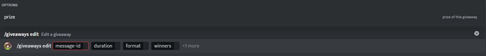

# Edit giveaway

:::info

The `content` and `channel` can't be edited using this command, if you made a mistake when starting the giveaway you will need to create it again.

:::

This subcommand will allow you to edit a giveaway, with the same parameters as the start subcommand. For this you will need to provide the giveaway message id, which you can get by right clicking the message and selecting "Copy Message ID".

## Usage

`/giveaways edit <message-id> <duration> <format> <winners> {prize} `

