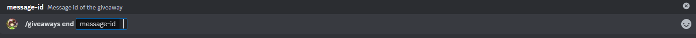

# End giveaway

This subcommand will allow you to end a giveaway. For this you will need to provide the giveaway message id, the command will end the choosen giveaway and select a winner. If no valid giveaway is found in the message with the id given, you will get an error and nothing will happen.

## Usage

`/giveaways end <message-id>`

