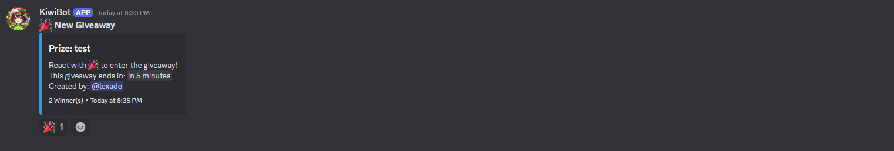
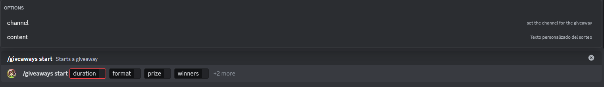

# Start giveaway

This subcommand will allow you to start a giveaway, with some customizable parameters such as the time of the giveaway, the prize and the number of winners.
After the command is executed, the bot will start the giveaway, if the channel is not specified, the channel used will be the current one if the bot has permissions to do it, otherwise the bot will do nothing.

Once created the giveaway will appear like this, and users can react to enter it.

## Usage

`/giveaways start <duration> <format> <prize> <winners> {channel} {content}`

