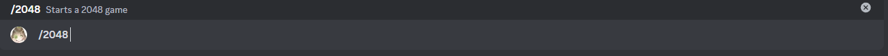

# 2048

This is the 2048 minigame, the goal is to reach the 2048 tile by merging matching numbers, slide tiles across the board to combine them and create higher values. Keep going until you hit the target or the board fills up.

## Usage

`/2048`

