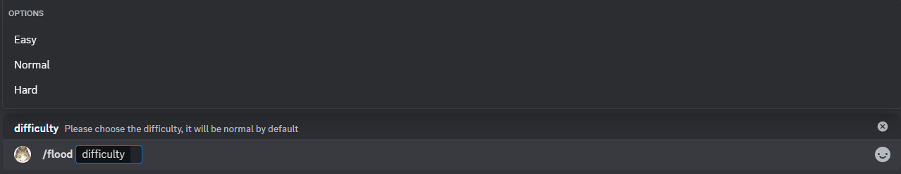

# Flood

This is the flood minigame, the goal is to transform the entire game board into a single uniform color within a limited number of moves, the difficulty setting will increase or decrease the turns avaliable.

## Usage

`/flood {difficulty}`

## Dificulty choices

There are 3 difficulty choices starting from easy to hard, each one determines the board size and number of moves avaliable for you.
