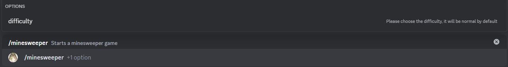

# Minesweeper

This is the minesweeper minigame, the goal is to to uncover all the safe squares whitout triggering a mine.

## Usage

`/minesweeper {difficulty}`

## Dificulty choices

There are 6 difficulty choices starting from very easy to extreme, this determine the number of mines to clear, placement in all difficulties is random. Normal difficulty is the default in case this parameter is not sent.

## Guide

- Grey squares (squares whitout a number) don't have any mines adjacent to them, this includes diagonals.

- Squares with a number mean there are that certain ammount of mines adjacent to it, includes diagonals.

In this example, it has one mine above it.

- Mines are marked by a bomb (as seen in the item above), if one mine is triggered you lose the game.

- In case of a win, the mines will be marked by a flag and filled with green.

