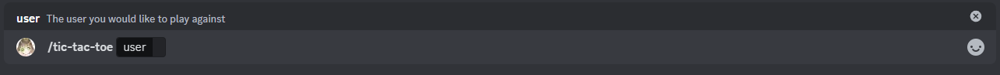

# Tic tac toe

This is the tic tac toe minigame, the goal is to fill a line, vertical, horizontal or diagonal before your oponent, this minigame requires two players to play, the player who sends the command will always be the first player, the game ends when either of the players fill a line, or a minute passes whitout any input.

## Usage

`/tic-tac-toe <user>`

