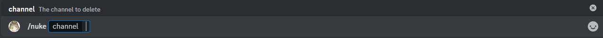

# Nuke

This is the nuke command, it allows you to delete a channel and re create it with the same permissions, for it the bot must have the permission to access, view and modify the specific channel.

## Usage

`/nuke <channel>`

