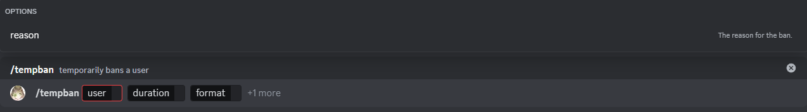

# Temp ban

This is the temp ban command, it will temporarly ban a user, and unban it after the given time. You can also include the reason for the ban.

## Usage

`/tempban <user> <duration> <format> {reason}`

