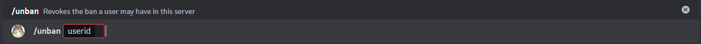

# Unban

This is the unban command, it allows you to remove a ban from a user, for it you need the user it, which is the code in numbers for the user, not the username which is alphanumeric.

## Usage

`/unban <userid>`

