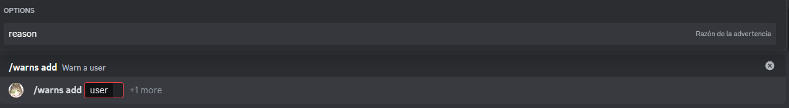

# Add warn

This is the add subcomand, it allows an administrator to add a new warning to a user.

## Usage

`/warns add <user> {reason}`

## Explanation

This command has 1 required parameter and 1 optional parameter.

### Required parameter

* user: This can be any user in the server.

### Optional parameter

* reason: This is the reason of the warning, if not specified will default to "no reason".