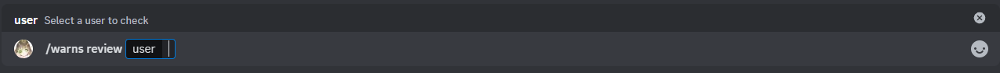

# Review warns

Thi is the review subcommand, it allows you to see the warnings for a given user, if the user does not have a warning the box will show a message stating that, otherwise will show the warnings.

## Usage

`/warns review <user>`

