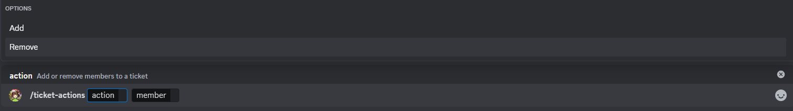

# Ticket actions

These are actions with the purpose of adding or removing a user to a specific ticket, adding a user gives it permission to send messages and read messages, removing it remove the permissions mentioned before.

## Usage

`/ticket-actions <action> <member>`

