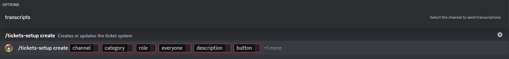

# Configure ticket system

This subcommand will allow you to configure the ticket system, this system is a little bit complex so it will be explained in parts.

## Usage

`/ticket-setup create <channel> <category> <role> <everyone> <description> <button> {transcripts}`

## Explanation

Configuring this system can be a littel bit confusing at the start. This guide will allow you to understand each parameter and it's functionality.

### Required parameters

* **channel**: This is the channel in which the bot will send the initial message serving as the entry point for the system, this is NOT the channel where tickets will be created.
* **category**: Inside the specified category the ticket channels will be created, it is recommended to have a empty category so it does not conflict with other channels.
* **role**: The role specified here will have permissions to see, access and do actions inside the ticket, it is recommended to set a support role or a administrator role (take into account that members with administrator permissions will bypass this role).
* **everyone**: In order to ensure compatibility, performance and minimize potential errors, you must send the everyone role here, this way the bot can cache it and perform any ticket actions faster.
* **description**: This will set the description text for the message which will be sent to the channel specified, this can be a description to your users for when to open a ticket or similar.
* **button**: The text the button to open a ticket, it is recommended to keep it short or set a emoji for it.

### Optional parameters

:::info

As an administrator, you are responsable of making users aware that their messages are being stored as a transcription.

:::
* **transcripts**: Setting this parameter will make the bot send a transcription as a .html file to the channel set here.