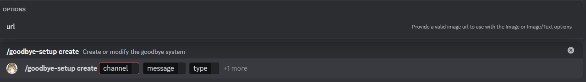

# Crear

:::caution

Si un sistema de despedidas existe, este será editado, de lo contrario, será creado.

:::

Este es el subcomando crear, puedes ejecutarlo con `/configurar-despedidas crear` this subcommand will allow you to create or edit the goodbye system.

## Uso

`/configurar-despedidas crear <canal> <mensaje> <tipo> {url}`

## Exiplicación

Este subcomando recibe 3 parámetros obligatorios y 1 opcional.

### Parámetros obligatorios

* canal: Este parámetro determina el canal en el cual el mensaje de despedida será enviado, solo puede ser un canal de texto.
* mensaje: Este parámetro determina el mensaje a utilizar, debe incluir `{user}` el cual será reemplazado por el nombre de usuario de quien haya abandonado el servidor.
* tipo: Este parámetro determina el tipo de despedida a utilizar, puede ser texto, imagen o ambas.

### Parámetros opcionales

* url: Este parámetro determina la imagen a utilizar, esta debe ser enviada en una url pública para evitar errores, solo será enviada si el tipo es `imagen` `imagen/texto`, en caso que sea `texto`, ninguna imagen será enviada.

:::note
Debido a que los errores potenciales son los mismos que en el subcomando crear del sistema de bienvenidas esa sección no será descrita aquí.
:::