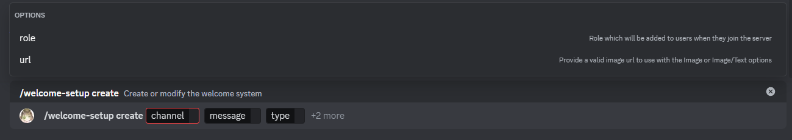
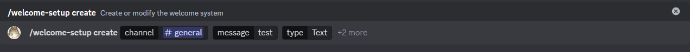
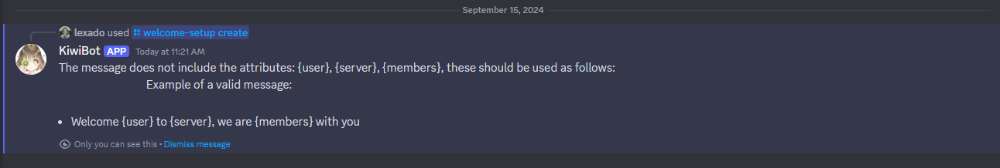
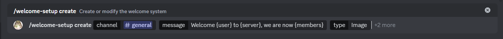
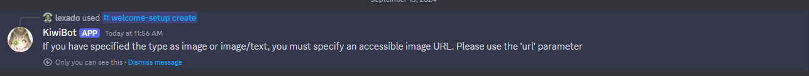
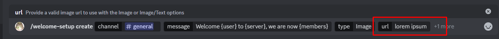
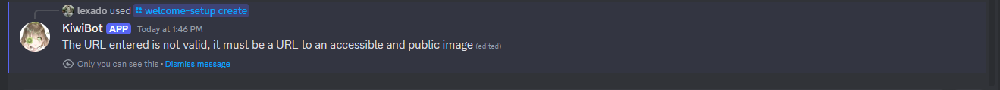
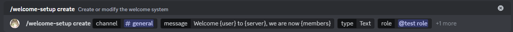
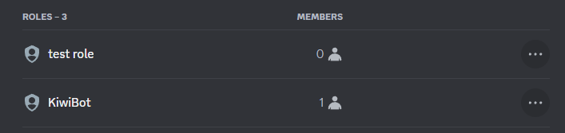
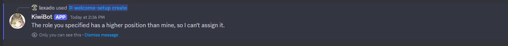

# Crear

:::caution

Si un sistema de bienvenidas existe, será editado, de lo contrario uno nuevo será creado.

:::

Este es el subcomando crear, puedes ejecutarlo con `/configurar-bienvenidas crear` este subcomando permite crear o editar el sistema de bienvenidas.

## Uso

`/configurar-bienvenidas crear <canal> <mensaje> <tipo> {rol} {url}`

## Explicación

Este subcomando recibe 3 parámetros obligatorios y 2 opcionales

### Parámetros obligatorios

* canal: Este parámetro determina el canal al cual se enviará el mensaje o imagen de bienvenida, solo puede ser un canal de texto.
* mensaje: Este parámetro determina el mensaje a enviar, debe incluir `{user}` `{server}` y `{members}` estos serán reemplazados respectivamente por, el nombre de usuario, el nombre del servidor y los miembros del servidor.
* tipo: Este parámetro determina el tipo de bienvenida a utilizar, puede ser de tipo imagen, texto, o ambas.

### Parámetros opcionales

* rol: Este parámetro, si es enviado, determina el rol que el bot asignará al usuario al momento de este ingresar al servidor. Para esto, el bot debe tener permisos superiores al rol especificado y permiso de asignar roles.

:::info

Si no deseas que el bot asigne un rol puedes enviar `@everyone` o dejarlo en blanco.

:::

* url: Este parámetro determina la imagen a utilizar, esta debe ser enviada en una url pública para evitar errores, solo será enviada si el tipo es `imagen` `imagen/texto`, en caso que sea `texto`, ninguna imagen será enviada.

## Errores potenciales

Esta sección cubrirá los errores causados por datos enviados erroneamente por el usuario.

### Los parámetros requeridos no son enviados en el mensaje

Este error sucede si en el mensaje no es enviado `{user}` `{server}` o `{members}` , para resolver este error, envia los parámetros dentro del mensaje.

El bot enviará un mensaje explicando como enviar cada parámetro.

### El tipo es `imagen` o `imagen/texto` pero no se ha enviado una url.

Si deseas que el bot envie una imagen como mensaje de bienvenida o junto al texto, debes enviar una url que apunte a una imagen.

### Has enviado una `url` inválida

Si una url inválida es enviada (cualquier url que no contenga una imagen pública en internet) un error sucederá, en el ejemplo anterior, "lorem ipsum" no es una url válida, y por tanto el comando no funcionará.

Para solucionar este error, basta con enviar una url válida, esta es un ejemplo: https://i.imgur.com/LKz0QqF.png

### El bot no tiene permiso para añadir el rol especificado

Este error sucederá si bot no tiene permisos para asignar el rol especificado en el parámetro `rol`.

En este ejmplo, estoy intentando asignar el rol "test role" pero este se encuentra encima del rol del bot, por tanto, sucederá un error.

El bot te avisará de esto con un mensaje.

Para solucionar este error, solo debes mover el rol que deseas asignar bajo el rol del bot, o seleccionar uno que se encuentre debajo del rol del bot.
