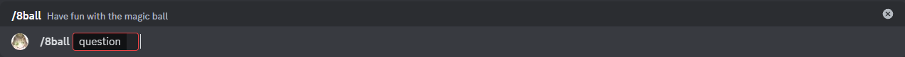

# Bola 8

Este es el comando Bola 8, con él puedes obtener una respuesta aleatoria de la bola mágica.

## Uso

`/8ball <pregunta>`

## Explicación

Este comando tiene 1 parámetro obligatorio. Las respuestas que envía son aleatorias basadas en un conjunto predefinido de respuestas, por lo que es posible que recibas respuestas repetidas después de un tiempo.

### Parámetro obligatorio

* pregunta: Esta es la pregunta que deseas hacerle a la bola mágica (tiene un límite de 500 caracteres).