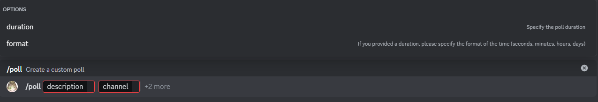

# Encuesta

Este es el comando Encuesta. Con este comando, puedes generar una encuesta personalizada por un período de tiempo determinado o de manera indefinida y cerrarla cuando quieras.

## Uso

:::note

Si un comando incluye `duración` y `formato` como parámetros opcionales, significa que si uno se establece, el otro se vuelve obligatorio; de lo contrario, ambos permanecen opcionales.

:::

`/encuesta <descripción> <canal> {duración} {formato}`

## Explicación

Este comando tiene 2 parámetros obligatorios y 2 parámetros opcionales.

### Parámetros obligatorios

* descripción: Este parámetro determina la descripción de la encuesta. Tiene un máximo de 250 caracteres.
* canal: Este parámetro determina el canal en el cual se enviará la encuesta. Debe ser un canal de solo texto, y el bot debe tener acceso y permisos para enviar mensajes y archivos adjuntos en él.

### Parámetros opcionales

* duración: Este parámetro determina la duración de la encuesta (se tomará en segundos, minutos, horas o días dependiendo del formato).
* formato: Este parámetro determina el formato en el que se tomará la duración.

## Errores potenciales

### Duración enviada pero formato no enviado / Formato enviado pero duración no enviada

Este error ocurre cuando solo se envía uno de los dos parámetros opcionales, ya sea duracion o formato, pero no ambos.  
Para solucionarlo, simplemente envía los dos parámetros.
