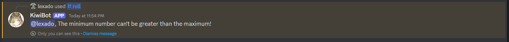

# Roll

Este es el comando roll, con él puedes generar un número "aleatorio" entre un valor mínimo y un valor máximo, con la opción de repetir la generación de números.

## Uso

`/roll <máximo> {mínimo} {repetir}`

## Explicación

Este comando tiene 1 parámetro obligatorio y 2 parámetros opcionales. El primer parámetro siempre será el número máximo que el bot puede devolver (1 es el mínimo para esto). El segundo parámetro es el número mínimo que el bot puede devolver, y debe ser menor que el número máximo. El tercer y último parámetro define cuántas veces (hasta 100) deseas que el bot repita el comando roll.

### Parámetros obligatorios

* máximo: Este parámetro determina el número máximo. Debe ser 1 o mayor que 1 y no puede ser un número negativo.

### Parámetros opcionales

* mínimo: Este parámetro determina el número mínimo. Debe ser menor que el número máximo o se devolverá un error.
* repetir: Este parámetro determina la cantidad de veces que el bot repetirá el comando. De forma predeterminada será 1, lo que significa que si solo deseas un lanzamiento, no necesitas enviar este parámetro.

## Errores potenciales

### El número mínimo es mayor que el número máximo

Este error ocurrirá si el número mínimo es mayor que el número máximo, ya que debido a cómo funciona el comando, esto es inválido. 

Para solucionarlo, debes especificar un número máximo mayor que el número mínimo.
