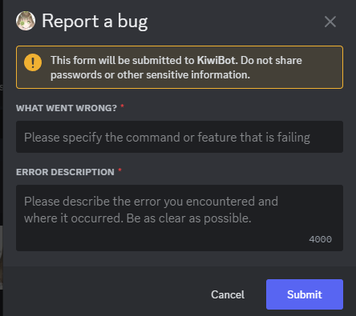

# Reportar errores

Este comando te permite enviar un reporte de error. Recuerda incluir la mayor cantidad de detalles posible para que podamos revisarlo.

## Uso

`/reportar-errores`

Después de ejecutar el comando, aparecerá un modal donde podrás escribir los detalles del error. Recuerda incluir la mayor cantidad de detalles posible.

