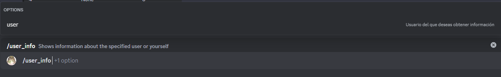

# Información usuario

Este comando te permitirá mostrar información de un usuario (o de ti mismo). Esta información incluye los roles que tiene el usuario, la fecha de creación de su cuenta, etc.

## Uso

`/información_usuario {usuario}`

### Parámetro opcional

* usuario: Este parámetro determina el usuario del cual quieres ver la información. Si no se envía, el bot mostrará la información sobre ti.
