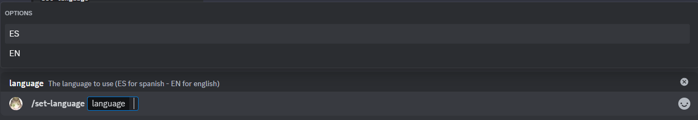

# Configurar idioma

Este es el comando configurar idioma, mediante este podrás cambiar de idioma las respuestas del bot entre el idioma por defecto (inglés) y otro idioma, los idiomas soportados actualmente son español (ES) e inglés (EN), pero esto puede cambiar en el futuro.

## Uso

:::note

Este comando solo funciona en servidores, en el caso de mensajes directos al bot, este responderá basado en tu idioma (o en inglés por defecto).

:::

`/configurar-idioma <idioma>`

