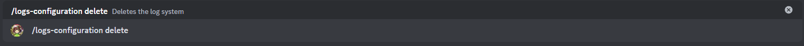

# Eliminar configuración de registros

Este subccomando te permitirá  eliminar la configuración de registros, posterior a esto el bot dejará de enviar los mensajes de registros al canal especificado. Para revertirlo, ejecuta el subcomando configurar nuevamente.

## Usage

`/logs-configuration delete`

