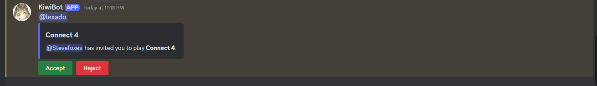

# Connect 4

Este es el minijuego de Conecta 4. El objetivo es alinear cuatro de tus fichas en una línea horizontal, vertical o diagonal antes que tu oponente.

## Uso

`/connecta4 <usuario>`

## Guía

Para jugar este minijuego, deberás mencionar al usuario con el que deseas jugar. Dicho usuario será notificado por el bot con el siguiente mensaje:

Para aceptarlo, simplemente haz clic en aceptar y el juego comenzará.

De lo contrario, haz clic en rechazar y el bot notificará al usuario que envió el comando que la solicitud para jugar fue rechazada con un mensaje.

