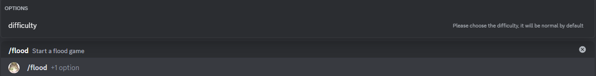

# inundación

Este es el minijuego de inundación. El objetivo es transformar todo el tablero de juego en un solo color uniforme dentro de un número limitado de movimientos. La configuración de dificultad aumentará o disminuirá los turnos disponibles.

## Uso

`/inundación {dificultad}`

## Dificulty choices

Hay 3 opciones de dificultad, desde fácil hasta difícil. Cada una determina el tamaño del tablero y el número de movimientos disponibles para ti.