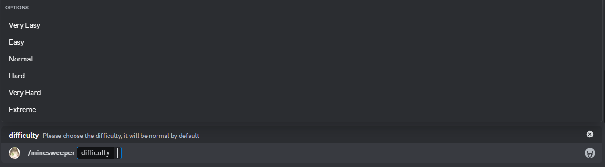

# Busca minas

Este es el minijuego de buscaminas, el objetivo es descubrir todas las casillas seguras sin activar una mina.

## Uso

`/buscaminas {dificultad}`

## Niveles de dificultad

Hay 6 niveles de dificultad, desde muy fácil hasta extremo. Esto determina la cantidad de minas a despejar, y su ubicación en todas las dificultades es aleatoria. La dificultad normal es la predeterminada en caso de que no se envíe este parámetro.

## Guía

- Las casillas grises (casillas sin un número) no tienen minas adyacentes, incluyendo diagonales.

- Las casillas con un número indican la cantidad de minas adyacentes, incluyendo diagonales.

En este ejemplo, hay una mina arriba.

- Las minas están marcadas con una bomba (como se ve en el elemento anterior). Si se activa una mina, pierdes el juego.

- En caso de ganar, las minas estarán marcadas con una bandera y rellenadas de color verde.

