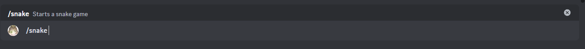

# Serpiente

Este es el minijuego de la serpiente. El objetivo es hacer la serpiente más grande posible sin chocar contigo mismo ni con los bordes del tablero. Para moverte, usa las flechas debajo del tablero, y para crecer, come las frutas que aparecen en el tablero.

## Uso

`/serpiente`

