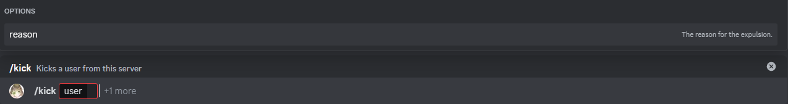

# Expulsar

Este es el comando de expulsar, te permite remover a un usuario del servidor sin restringirle la posibilidad de unirse nuevamente. También puedes especificar una razón.

## Uso

`/expulsar <usuario> {razón}`

