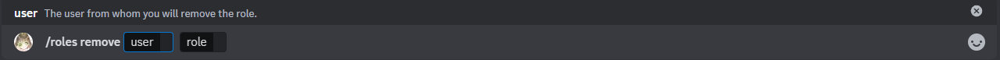

# Remover rol

Este es el subcomando para eliminar roles, te permite quitar un rol específico a un usuario.

## Uso

`/roles remover <usuario> <rol>`

## Explicación

Este comando tiene 2 parámetros obligatorios: el usuario al que se le eliminará el rol y el rol que se eliminará.

### Parámetros obligatorios

* usuario: Este puede ser cualquier usuario en el servidor que tenga el rol, si el usuario no tiene el rol, no ocurrirá nada.
* rol: Este rol debe estar por debajo del rol del bot, de lo contrario, el bot no tendrá permiso para eliminarlo y se mostrará un error.