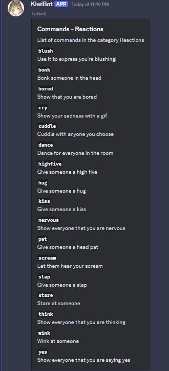

# Reacciones

Esta es la carpeta de reacciones. Por simplicidad, solo se proporciona este archivo de explicación, ya que todas las reacciones se ejecutan de la misma manera: /[reacción], donde "reacción" es el nombre de la reacción específica. Esto se puede verificar con el comando /help o con la lista a continuación.

