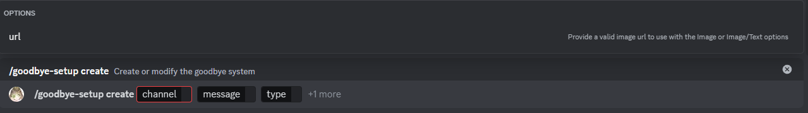

# Create

:::caution

If a goodbye system already exists, it will be edited, otherwise it will be created.

:::

This is the create subcommand, it will be executed by using `/goodbye-setup create` this subcommand will allow you to create or edit the goodbye system.

## Usage

`/goodbye-setup create <channel> <message> <type> {url}`

## Explanation

This subcommand has 3 required parameters and 1 optional parameter

### Required parameters

* channel: This parameter determines the channel in which the goodbye message will be sent, it can only be a text channel.
* message: This parameter determines the message that will be sent in the defined channel, it must include in it `{user}` which will be replaced for the value of the username who left the server.
* type: This parameter will determine the type of message sent, it can either be a text message, a image, or both.

### Optional parameters

* url: This parameter determines the url to the image that will be sent if the type parameter is set to `image` or `image/text`, otherwise it can be omitted, for `text` type goodbyes, it will not do anything.

:::note
Due to the potential errors being too similar to the [`welcome system create subcommand`](/docs/announcements/welcomes-system/create) that section will not included here, potential errors for `message` and for `url` are covered there
:::