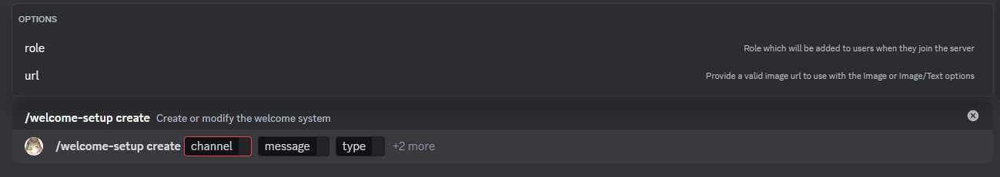
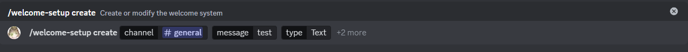
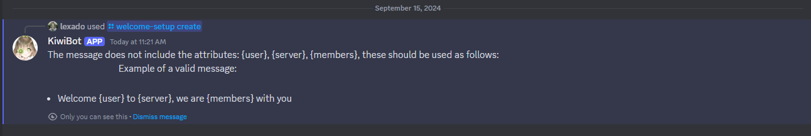
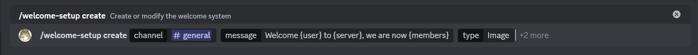
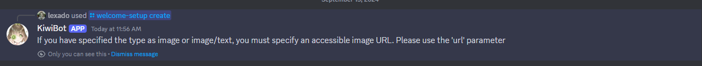
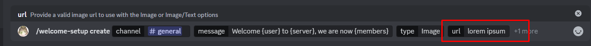
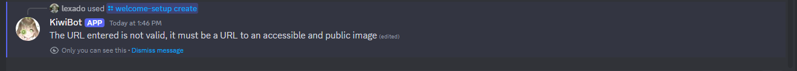
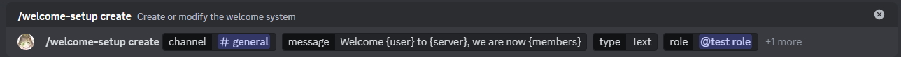
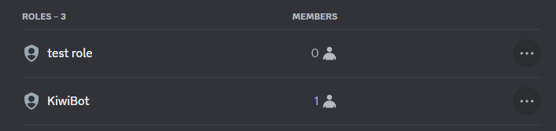
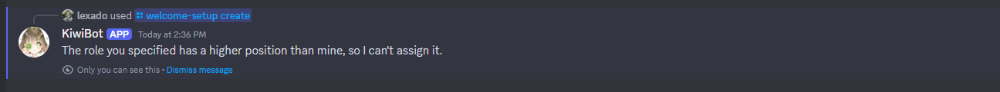

# Create

:::caution

If a welcome system already exists, it will be edited, otherwise it will be created.

:::

This is the create sub command, it will be executed by using `/welcome-setup create` this subcommand will allow you to create or edit the welcome system.

## Usage

`/welcome-setup create <channel> <message> <type> {role} {url}`

## Explanation

This command has 3 required parameters and 2 optional parameters

### Required parameters

* channel: This parameter determines the channel in which the welcome message will be sent, it can only be a text channel.
* message: This parameter determines the message that will be sent in the defined channel, it must include in it `{user}` `{server}` and `{members}` those will be replaced for the values (user will be replaced by the username of the user who joined, server will be replace by the server name, and members will be replaced by the number of members in the server).
* type: This parameter will determine the type of message sent, it can either be a text message, a image, or both.

### Optional parameters

* role: This parameter determine if the user will be assigned a role upon joining the server, the role must be below the bot's role to be assgined otherwise it will not work.

:::info

If you don't want the bot to assign a role to the user, send `@everyone` in this parameter or leave it blank, and the bot will not try to assign any role.

:::

* url: This parameter determines the url to the image that will be sent if the type parameter is set to `image` or `image/text`, otherwise it can be omitted, for `text` type welcomes, it will not do anything.

## Potential errors

This section will cover most potential errors that can be caused due to user mistakes and how to solve each one.

### The required parameters in message are not included

This error will happen if in message `{user}` `{server}` or `{members}` are not included, to solve this error simply add the parameters within your text, currently all three are required but this might change in the future.

The bot will also reply with an explanation on how to send the message parameter, it will contain an example as well.

### Type is set to `image` or `image/text` but no image url is provided

If you want the bot to send a image as the welcome message, you must use the `url` parameter, if not provided, a error will happen, and you will be notified about it, to solve this error add a valid url in the url parameter.

### A invalid url was provided in the `url` parameter

If a invalid url is provided (a invalid url is anything that does not point to a public accesible image on the internet) a error will happen, in the image above, "lorem ipsum" is not a valid url therefore it will not work and show the following error

To solve this error, you must provide a valid image url, here is a valid url for example https://i.imgur.com/LKz0QqF.png

### The bot role is below the role you want the bot to assign users upon joining

This error will be caused if the rol specified in the parameter `role` is above the bot role, since the bot will not have permission to assign the given role in this case, it will show an error.

In this example, I'm trying to use the role "test role" but it is above the bot role, therefore the bot will show an error

The bot will also notify you about it with a message

To solve this error, you must place the bot role above the role you want to assign or choose a role that is below the bot role

