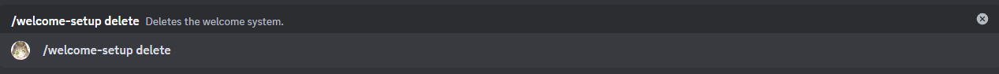

# Delete

:::danger

If you execute this command the bot will stop to handle user joins to the server and you will have to create the welcome system again from scratch

:::

This is the delete subcommand, it will be executed by using `/welcome-setup delete ` this subcommand will allow you to delete the welcome system.

## Usage

`/welcome-setup delete`

:::note

If no welcome system exist, you will get a message from the bot, but nothing will actually happen.

:::