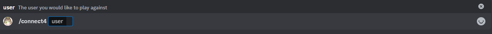

# Connect 4

This is the connect4 minigame, the goal is to fill four of your pieces in a horizontal, vertical or diagonal line before your opnent.

## Usage

`/connect4 {user}`

## Guide
To play this minigame, you will need to mention a the desired user to play against, said user will be pinged by the bot with the following message:

To accept it, simply click on accept and the game will start.

Otherwise click on reject and the bot will notifiy the user who sent the command that the request to play a game was rejected with a message.

